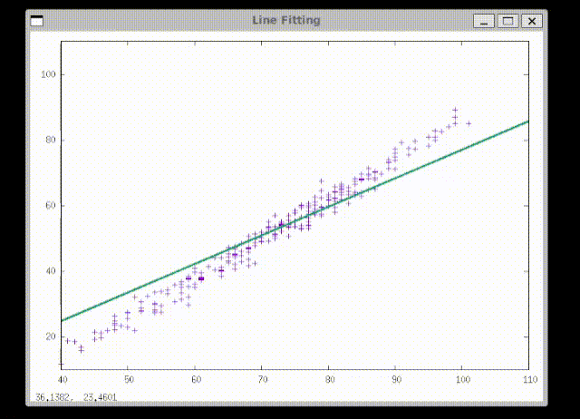
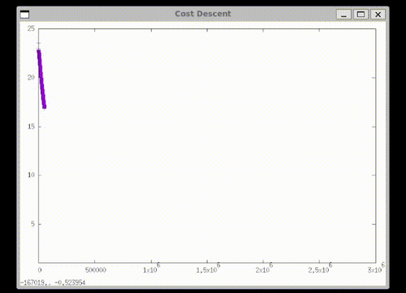
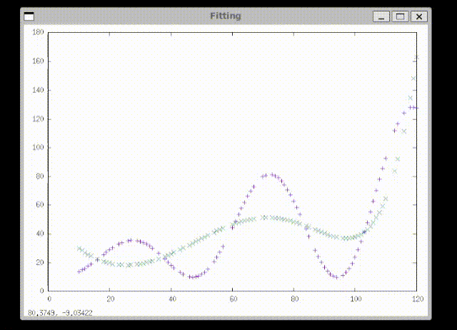

# Daniyal Machine Learning Framework (DMLFW)

## Introduction

Daniyal Machine Learning Framework (DMLFW) is a personal educational project to explore machine learning by building core algorithms and tools **from scratch in C**. It aims to teach and experiment with data preprocessing, training, prediction, and evaluation techniques.

***

## Installation

### Prerequisites

* GCC or any C compiler  
* Bash shell  

### Steps

1. Clone the repository:

   ```bash
   git clone https://github.com/Mohammedaniyal/machine-learning.git
   cd machine-learning
   ```

2. Build the core library:

   ```bash
   cd ml-framework/o_files
   sh create_lib.sh
   ```

   This compiles source files and generates `libml-framework.a` in `ml-framework/lib/`.

***

## **Quick Start Example (Anywhere on your system)**

**What this example demonstrates:** *Creating a column vector, setting values, and computing the mean using DMLFW.*

1. **Create a C file** anywhere you like — for example, in the **root folder** where `ml-framework/` exists:

```bash
cd ~/machine-learning      # root folder where ml-framework exists
nano myprogram.c      # or create the file with any editor
```

2. **Paste this code**:

```c
#include <stdio.h>
#include <stdlib.h>
#include <dmlfw_vector.h>
#include <dmlfw_error.h>

int main(void) {
    char err[512], dbg[512];

    dmlfw_column_vec_double *col_vec = dmlfw_column_vec_double_create_new(3);
    if (dmlfw_error()) {
        dmlfw_get_error_string(err, sizeof(err));
        dmlfw_get_debug_string(dbg, sizeof(dbg));
        printf("Error creating column vector: %s\nDebug info: %s\n", err, dbg);
        return EXIT_FAILURE;
    }

    dmlfw_column_vec_double_set(col_vec, 0, 1.0);
    dmlfw_column_vec_double_set(col_vec, 1, 2.0);
    dmlfw_column_vec_double_set(col_vec, 2, 3.0);

    double mean = dmlfw_column_vec_double_get_mean(col_vec);
    printf("Mean of column vector: %lf\n", mean);

    dmlfw_column_vec_double_destroy(col_vec);
    return EXIT_SUCCESS;
}
```

3. **Compile the program** using GCC, pointing to the framework’s include and lib directories:

```bash
gcc myprogram.c -I ./ml-framework/include -L ./ml-framework/lib -lml-framework -lm -o myprogram
```

4. **Run the program**:

```bash
./myprogram
```

5. **Expected Output:**

```
Mean of column vector: 2.000000
```

---

### **Notes**

* You can place your C file **anywhere**, as long as you provide the **correct `-I` and `-L` paths** to GCC.
* The `-I` flag points to the **header files** (`ml-framework/include`).
* The `-L` flag points to the **library files** (`ml-framework/lib`) and `-lml-framework` tells GCC to link the static library.
* `-lm` links the math library (needed for operations in the framework).


***

## Usage

* Prebuilt example programs are in the [`ml-examples/`](ml-examples/) folder. Explore, compile, and run to understand framework usage.  
* Command-line preprocessing tools are in [`tools/`](tools/), with executables built via `src/cmp.sh`. You may install these tools in a system path (e.g., `/usr/bin`) for ease of use or run them from their build folders.  
* You can build your own C programs linking against the library:

  ```bash
  gcc myprogram.c -I ./ml-framework/include -L ./ml-framework/lib -lml-framework -lm -o myprogram
  ```


* For detailed tutorials exploring all stages of workflow:  
  - Use [`ml-examples/TUTORIAL_PREPROCESSED.md`](ml-examples/regression/linear/TUTORIAL_PREPROCESSED.md) for running example programs with preprocessed datasets.  
  - Use [`ml-examples/TUTORIAL_RAW.md`](ml-examples/regression/linear/TUTORIAL_RAW.md) for step-by-step guidance on preprocessing raw datasets with the provided tools.  
  - Use [`tools/TUTORIAL.md`](tools/TUTORIAL.md) for comprehensive instructions on using the command-line preprocessing utilities.

***

## Visual Preview

Get a firsthand look at the graphical output from the core ML algorithms:

### Batch Gradient Descent

**Line fitting process:**



**Cost reduction over training:**



---

### Polynomial Batch Gradient Descent

**Curve fitting process:**



---

*GNUPLOT must be installed to view these graphical outputs when running example programs.*

***

## Project Structure

* `ml-framework/` – Core framework source code, headers, and build scripts.  
* `ml-examples/` – Sample programs demonstrating key ML algorithms and workflows, with `preprocessed/` and `test/` subfolders for datasets.  
* `tools/` – Command-line utilities for data preprocessing and encoding, with source and build folders.  
* `docs/` – Documentation files and generated Doxygen output.

***

## Learn More

* Explore comprehensive API references, detailed usage examples, and generated documentation in the [Doxygen Documentation](https://Mohammeddaniyal.github.io/machine-learning).  
* Browse additional practical code samples and supporting materials in the [`ml-examples/`](ml-examples/) folder to deepen your understanding and experimentation.  
* For broader context on framework design and implementation, consult the documentation files inside the [`docs/`](docs/) folder.

***
## Platform Support

* Built and tested on Linux with `pthread` and POSIX APIs.  
* Windows users should build under WSL or a compatible Linux environment.

***

## Contact

Maintainer: Mohammed Daniyal  
Email: [mohammeddaniyal453@gmail.com](mailto:mohammeddaniyal453@gmail.com)  
LinkedIn: [mohammeddaniyalali](https://www.linkedin.com/in/mohammeddaniyalali)  

***

Thank you for exploring DMLFW!  
This project is a work-in-progress learning journey—happy experimenting!

***

